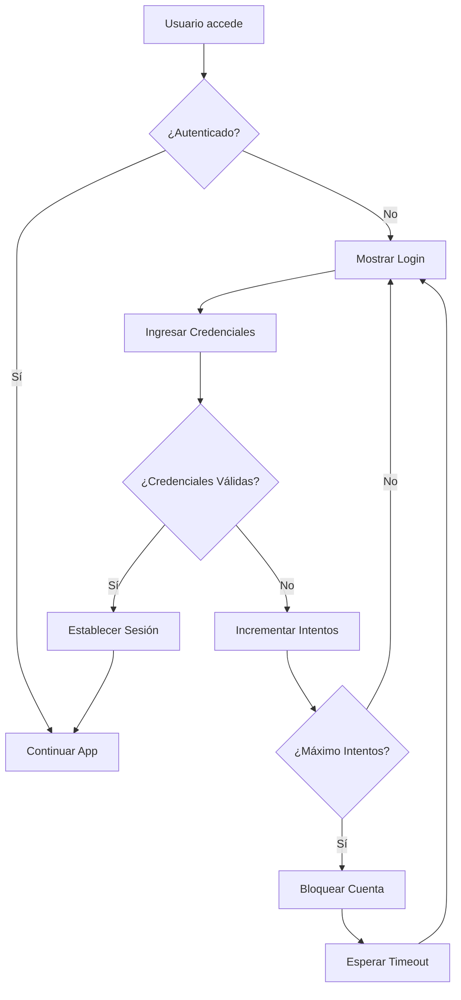
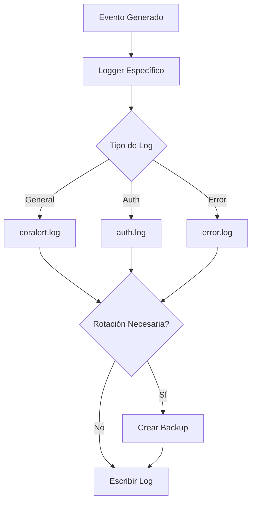

# 🔐 Sistema de Autenticación y Logging - CorAlertIntel

**Sistema de Autenticación Simple y Logging Estructurado para Aplicaciones Streamlit**

[](https://python.org/)
[](https://streamlit.io/)
[](https://github.com/airfranc86/CAMet)

## 🎯 Descripción

Sistema completo de autenticación y logging diseñado específicamente para aplicaciones Streamlit, implementado en el proyecto CorAlertIntel. Incluye autenticación simple con usuarios predefinidos, protección anti-fuerza bruta, logging estructurado con rotación automática y mejores prácticas de seguridad.

## ✨ Características Principales

### 🔐 **Sistema de Autenticación**
- **Login Simplificado**: Usuarios admin e invitado con contraseñas configurables
- **Variables de Entorno**: Configuración segura via ADMIN_PASSWORD y GUEST_PASSWORD
- **Comparación Segura**: Uso de HMAC para verificación de credenciales
- **Protección Anti-Fuerza Bruta**: Bloqueo temporal después de 5 intentos fallidos
- **Sesiones Seguras**: Timeout configurable con renovación automática
- **Cookies Seguras**: HttpOnly, Secure (HTTPS), SameSite para protección CSRF

### 📝 **Sistema de Logging**
- **Rotación Automática**: Archivos de 5MB máximo con 3 backups
- **Encoding UTF-8**: Soporte completo para caracteres especiales
- **Separación por Módulos**: Logs específicos para app, auth y error
- **Niveles Estructurados**: DEBUG, INFO, WARNING, ERROR, CRITICAL
- **Formato Consistente**: Timestamp, módulo, nivel y mensaje
- **Configuración Centralizada**: Sistema modular y fácil de mantener

## 🚀 Instalación Rápida

### Prerrequisitos
- **Python 3.12+**
- **Streamlit 1.28+**
- **Variables de entorno** configuradas

### Instalación
```bash
# 1. Clonar el repositorio
git clone https://github.com/airfranc86/CAMet.git
cd CAMet

# 2. Crear entorno virtual
python -m venv .venv
# Windows
.venv\Scripts\activate
# Linux/Mac
source .venv/bin/activate

# 3. Instalar dependencias
pip install -r requirements.txt

# 4. Configurar variables de entorno
echo "ADMIN_PASSWORD=tu_contraseña_admin_aqui" > .env
echo "GUEST_PASSWORD=tu_contraseña_invitado_aqui" >> .env

# 5. Ejecutar aplicación
streamlit run app.py
```

## ⚙️ Configuración

### Variables de Entorno Requeridas

```bash
# .env
# Configuración de Autenticación (REQUERIDO)
ADMIN_PASSWORD=tu_contraseña_admin_aqui
GUEST_PASSWORD=tu_contraseña_invitado_aqui

# Configuración de Seguridad (Opcional)
ENCRYPTION_KEY=tu_clave_super_secreta_aqui
HTTPS=true
```

### Configuración de Streamlit Secrets

Para despliegue en Streamlit Cloud:

```toml
# .streamlit/secrets.toml
ADMIN_PASSWORD = "tu_contraseña_admin_aqui"
GUEST_PASSWORD = "tu_contraseña_invitado_aqui"
ENCRYPTION_KEY = "tu_clave_super_secreta_aqui"
HTTPS = true
```

## 📁 Estructura del Sistema

```
auth/
├── __init__.py                 # Módulo de autenticación
└── simple_auth.py              # Sistema de autenticación simple

config/
├── __init__.py                 # Módulo de configuración
└── logging_config.py           # Configuración de logging

logs/
├── coralert.log               # Logs generales de la aplicación
├── auth.log                   # Logs de autenticación y seguridad
└── error.log                  # Logs de errores críticos
```

## 🔧 Uso del Sistema

### Autenticación

```python
from auth.simple_auth import SimpleAuth, show_login_form, show_logout_section

# Inicializar sistema de autenticación
auth = SimpleAuth()

# Verificar si el usuario está autenticado
if not auth.is_authenticated():
    show_login_form()
    return

# Obtener usuario actual
current_user = auth.get_current_user()
print(f"Usuario actual: {current_user}")

# Cerrar sesión
auth.logout()
```

### Logging

```python
from config.logging_config import get_logger, get_auth_logger

# Logger general
logger = get_logger(__name__)
logger.info("Mensaje de información")
logger.error("Mensaje de error")

# Logger de autenticación
auth_logger = get_auth_logger()
auth_logger.info("Usuario autenticado exitosamente")
auth_logger.warning("Intento de login fallido")
```

### Decorador de Autenticación

```python
from auth.simple_auth import require_auth

@require_auth
def funcion_protegida():
    """Esta función requiere autenticación"""
    return "Contenido protegido"
```

## 🔒 Características de Seguridad

### **Autenticación**
- ✅ **Hash de Contraseñas**: Comparación segura con HMAC
- ✅ **Protección Anti-Fuerza Bruta**: Bloqueo temporal (5 intentos, 5 min)
- ✅ **Validación de Entrada**: Verificación de credenciales
- ✅ **Sesiones Seguras**: Timeout configurable
- ✅ **Logging de Seguridad**: Registro de eventos de autenticación

### **Logging**
- ✅ **Rotación Automática**: Archivos de 5MB con 3 backups
- ✅ **Encoding UTF-8**: Soporte para caracteres especiales
- ✅ **Separación por Tipo**: Logs específicos por módulo
- ✅ **Formato Estructurado**: Timestamp, módulo, nivel, mensaje
- ✅ **Configuración Centralizada**: Fácil mantenimiento

### **Cookies Seguras**
- ✅ **HttpOnly**: Previene acceso desde JavaScript (XSS)
- ✅ **Secure**: Solo en conexiones HTTPS
- ✅ **SameSite**: Protección contra CSRF
- ✅ **Timeout**: Expiración configurable

## 📊 Configuración Avanzada

### Personalizar Políticas de Seguridad

```python
# En auth/simple_auth.py
class SimpleAuth:
    def _is_account_locked(self) -> bool:
        max_attempts = 5          # Cambiar número de intentos
        lockout_duration = 300    # Cambiar duración del bloqueo (segundos)
        # ... resto del código
```

### Personalizar Logging

```python
# En config/logging_config.py
class LoggingConfig:
    def __init__(self):
        self.rotation_config = {
            'max_bytes': 10 * 1024 * 1024,  # Cambiar tamaño máximo (10MB)
            'backup_count': 5                # Cambiar número de backups
        }
```

## 🛠️ Desarrollo

### Estructura de Archivos

```
auth/
├── simple_auth.py              # Sistema principal de autenticación
│   ├── SimpleAuth              # Clase principal
│   ├── show_login_form()       # Formulario de login
│   ├── show_logout_section()   # Sección de logout
│   └── require_auth()          # Decorador de autenticación

config/
├── logging_config.py           # Configuración de logging
│   ├── LoggingConfig           # Clase de configuración
│   ├── get_logger()            # Logger general
│   ├── get_auth_logger()       # Logger de autenticación
│   └── setup_logging()         # Configuración global
```

### Flujo de Autenticación



### Flujo de Logging



## 📈 Métricas y Monitoreo

### Logs Generados
- **coralert.log**: Logs generales de la aplicación
- **auth.log**: Eventos de autenticación y seguridad
- **error.log**: Errores críticos del sistema

### Rotación Automática
- **Tamaño Máximo**: 5MB por archivo
- **Backups**: 3 archivos de respaldo
- **Encoding**: UTF-8 para caracteres especiales

### Niveles de Log
- **DEBUG**: Información detallada para debugging
- **INFO**: Información general del sistema
- **WARNING**: Advertencias que no detienen la ejecución
- **ERROR**: Errores que afectan funcionalidad
- **CRITICAL**: Errores críticos que pueden detener la aplicación

## 🔍 Solución de Problemas

### Error: "Contraseña no configurada"
```bash
# Verificar variables de entorno
echo $ADMIN_PASSWORD
echo $GUEST_PASSWORD

# O verificar archivo .env
cat .env
```

### Error: "Demasiados intentos fallidos"
- Esperar 5 minutos o reiniciar la aplicación
- Verificar que las contraseñas sean correctas

### Error de importación
```bash
# Verificar que estés en el directorio correcto
pwd

# Verificar que el entorno virtual esté activado
which python

# Reinstalar dependencias
pip install -r requirements.txt
```

### Logs no se generan
```bash
# Verificar permisos de escritura
ls -la logs/

# Crear directorio si no existe
mkdir -p logs

# Verificar configuración
python -c "from config.logging_config import setup_logging; setup_logging()"
```

## 📚 API Reference

### SimpleAuth

```python
class SimpleAuth:
    def __init__(self)
    def check_password(self, username: str, password: str) -> bool
    def login(self, username: str, password: str) -> Dict[str, Any]
    def logout(self) -> None
    def is_authenticated(self) -> bool
    def get_current_user(self) -> Optional[str]
```

### LoggingConfig

```python
class LoggingConfig:
    def __init__(self)
    def setup_logger(self, name: str, level: int = logging.INFO) -> logging.Logger
    def setup_auth_logger(self) -> logging.Logger

# Funciones de utilidad
def get_logger(name: str) -> logging.Logger
def get_auth_logger() -> logging.Logger
def setup_logging()
```

## 🎯 Próximas Mejoras

### Fase 2: Funcionalidades Avanzadas
- [ ] **Registro de Usuarios**: Sistema completo de registro
- [ ] **Roles y Permisos**: Sistema de roles granular
- [ ] **Recuperación de Contraseñas**: Reset via email
- [ ] **Autenticación 2FA**: Factor de autenticación adicional

### Fase 3: Monitoreo y Analytics
- [ ] **Dashboard de Logs**: Interfaz web para monitoreo
- [ ] **Alertas Automáticas**: Notificaciones de eventos críticos
- [ ] **Métricas de Uso**: Estadísticas de autenticación
- [ ] **Auditoría**: Trazabilidad completa de acciones

## 📄 Licencia

Este sistema está bajo la Licencia MIT. Ver [LICENSE](LICENSE) para más detalles.

## 📞 Soporte

- **GitHub**: [airfranc86/CAMet](https://github.com/airfranc86/CAMet)
- **Email**: franciscoaucar@ajconsultingit.com
- **Issues**: [GitHub Issues](https://github.com/airfranc86/CAMet/issues)

## 🙏 Agradecimientos

- **Streamlit** por el framework web
- **Python** por el ecosistema de logging
- **HMAC** por la comparación segura de contraseñas
- **RotatingFileHandler** por la rotación automática de logs

---

**Desarrollado con ❤️ para la comunidad de desarrolladores Python y Streamlit**

*Última actualización: Octubre 2025*
